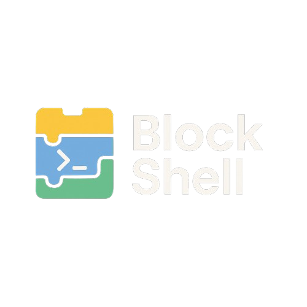

  

# BlockShell
A drag-and-drop, Scratch-style CLI builder. Build terminal commands like LEGO blocks.

## Features
- Visual CLI command builder
- Real-time bash preview
- Built-in terminal emulator

# Installation
🚀 Prerequisites

Make sure you have:

    Node.js (v18 or later)

    Git

# Clone and Run
    

### 1. Clone the repo
git clone https://github.com/horizon7006/blockshell.git
cd blockshell

### 2. Install dependencies
npm install

### 3. Start the app
npm run dev

## Tech Stack
- Electron + React + Vite
- Blockly (coming soon)
- Node.js
- xterm.js

## License
MIT
